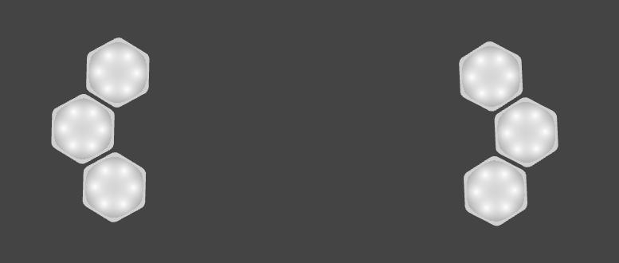

# Project 1 - KanJam Remixed

KanJam
- Number of Players: 2
- Number of Blinks: 8
- Time to play: 5 minutes

### Description
#### The Original Game
The ruleset of KanJam is quite simple, but since not everyone has played it, here is a short video that covers how the game is played.
https://www.youtube.com/watch?v=hwF90SDWkEI

## Game Instructions

### Setup
KanJam Remixed requires 8 Blinks for the game to be played. Six of the blinks are used for the cans (three blinks per can) and the remaining two blinks will be the frisbees assigned to the two teams. Once KanJam Remixed is loaded onto the Blinks, the Blinks will be in the default can (GOAL) state. Cans are colored cyan. Below to properly arrange the Blinks that will serve as the cans. The two cans should be spread a decent distance away from each other. The farther the distance, the harder it will be to score.

Each of the two teams is assigned their own frisbee that they will use for the rest of the game. Once each team is given a blink, long press to send the Blink into the frisbee state. Once in the frisbee state, double click to swap between teams. Each team should choose a different color. There are 3 different team colors to choose from. Once team selection is completed, the game can begin.

### Gameplay
Teams will alternate "throwing their frisbees" towards their respective cans. If the frisbee lands in the can (connected to the three inner faces of the can blinks), a point is scored. The current score of the team will be displayed on the Blink. The first team to 6 points wins. The winnig team's blink will turn green. Connect all blinks together and triple click one of the blinks in the cluster to reset the game.

**NOTE:** If you score a point on your throw, the blink must be disconnected from the can within 3 seconds so that multiple points are not scored at once.

### Win Condition
Be the first to slot your frisbee 6 times.

## Process

- Inspiration
I played a lot of KanJam throughout my younger years, either at barbeques or in gym class. Since I spent almost the entirety of the first class session raving about the game, I wanted to try to bring at least a part of it to the rest of the class.

- Design Process
I started by creating a short list of variables that I thought I would be using throughout the program. After I figure out how I want to send data between blinks and write the functions for retrievig data from the values being sent between blink faces. After that is done, I focused on writing the gameplay loops. The most difficult part was having the correct logic for recording scores.

- Learning, Questions, Notes
While I was making the game I was reflecting about the changes I made to the original ruleset. I came to the conclusion that, in its current state, KanJam Remixed is probably closer to basketball or soccer. Going forward, I would probably change the game so that the scoring system more closely resembles that of the original game.