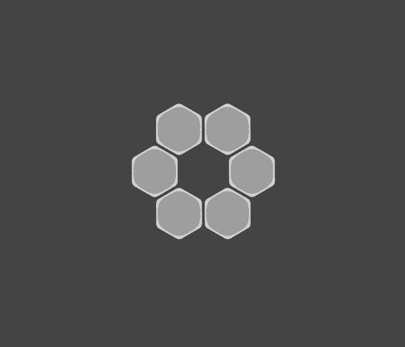

# Project 2 - Color in Motion

Principle: 
- Core Mechanic: Movement
- Prototype of Core Mechanic

- Number of Players: Originally designed with single player in mind (realistically could be played by 1-6 players, with each player responsible for their own blink)
- Number of Blinks: 6
- Time to play: ∞

### Description
A game in which you continuously move your color to the next blink in the loop. 

## Game Instructions

### Setup
This game requires six blinks to play. Setup for the game is complete when all six blinks are in a circle. Once the six blinks are in a loop, double click any one of the six blinks. A circling animation should start on the clicked blink, denoting the start of the game.

### Gameplay
Single Player:
Once the game is started, there should be an animation where the brightest face on the blink is moving in a cricle. To progress in the game, press the active blink when the brightest face is connected to the next blink in the loop. If successful, the previously active blink will display the solid color that was previously animated. Upon failure, the blink will display the same animation in red.

Multiplayer:
In the multiplayer version of the game, the rules stay the same, but players must decide beforehand which blinks they are responsible for. 

### Win Condition
See how long you can play without reaching the fail state.

## Process
- Inspiration:
This game was inspired by the video game, Gris. I wanted to create something that emulated the smooth movements the player character makes to move throughout the levels of the game. I also wanted a game that moved through a series of colors as the player progressed through the game. The blinks are off at the outset of the game, similar to how the world in Gris was devoid of color.
- Design Process:
I began by singling out a couple aspects of Gris that I wanted to try to emulate within the world of blinks. Once I landed on a couple of ideas I began thinking about how I wanted to translate them to blinks. I decided I wanted some type of animation and then player input to represent the movement of the character. I wanted the colors to change once a complete loop was successfully made to signfiy a sort of movement between levels. 
- Learning, Questions, Notes
There are still some issues in the gameplay. I was not able to figure out why the animation is not being passed to the next blink inthe loop, even though the blinks will appropriately enter the success or failure states. Also, the game starts in the fail state, but appropriately enters the gameplay active animation if you remove the blink from the loop.